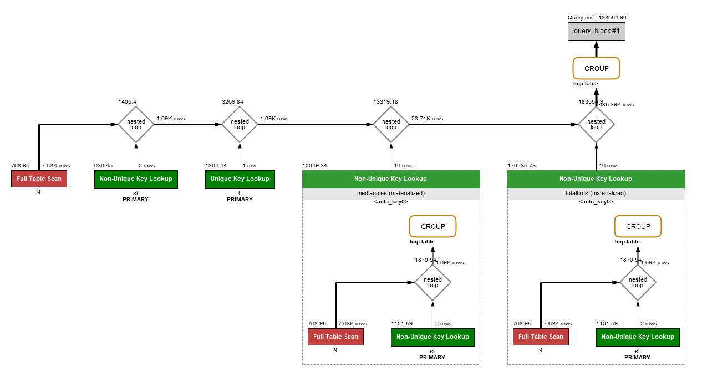
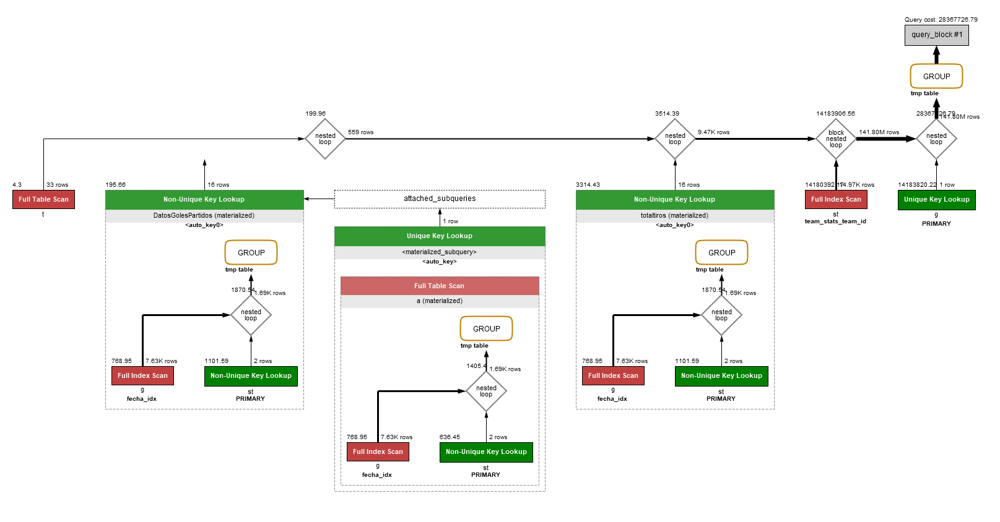
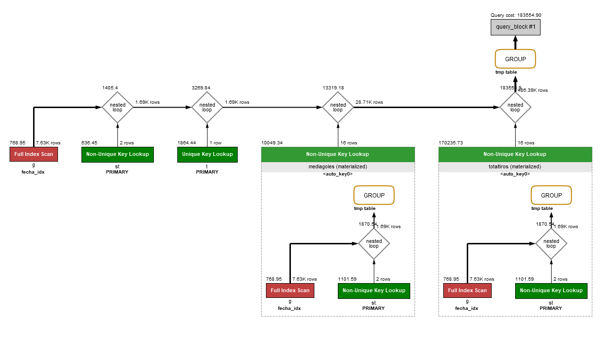

# Práctica 2 Bases de Datos

Francisco Rodríguez Cuenca y Alejandro Lozano Morales
## 1. Importación del proyecto

## 2. Estudio de planes de consulta e índices.

### **a. Crear una consulta SQL que permita obtener el número de partidos jugados por cada jugador para aquellos jugadores de nacionalidad estadounidense (USA) o canadiense (CAN) que hayan jugado más partidos que la media del número de partidos jugados por todos los jugadores. La consulta devolverá el nombre y apellido del jugador y su edad actual, así como el número de partidos jugados, pero el resultado estará ordenado descendentemente por edad e a igual edad por apellido seguido de nombre pero ascendentemente.**

````sql
USE practica2bda;

SELECT p.firstName, p.lastName, p.edad, COUNT(ps.game_id) AS numPartidos
FROM player p INNER JOIN player_stats ps ON p.player_id = ps.player_id
WHERE nationality = 'CAN' OR nationality = 'USA'
GROUP BY p.firstName, p.lastName, p.edad
HAVING COUNT(ps.game_id) > (
    SELECT AVG(a.numPartidos) AS media
    FROM (
            SELECT player_id ,COUNT(game_id) AS numPartidos
            FROM player_stats
            GROUP BY player_id
        )
    AS a
);
````

### **b. Estudiar el plan de consulta, tomando nota de los costes del mismo y comentarlo.**


>Se puede observar en la imagen que esta consulta es altamente ineficiente, ya que se realiza un producto cartesiano de dos tablas completas sin la ayuda de índices.

### **c. Crear las claves principales y foráneas mediante los ficheros script CrearClavesPrimarias.sql y CrearClavesForaneas.sql, y nuevamente estudiar el plan de consulta, comparando costes con el punto anterior.**


> En esta imagen se puede observar que una vez creadas las claves principales y foráneas, el sistema crea automáticamente índices que luego le ayudan a seleccionar únicamente las filas de player_stats que coinciden con la tabla player, sin tener que buscar por toda la tabla. 

> Esto se debe a que player_id es clave principal de player y player_stats, y foránea de player_stats. El sistema ha creado el índice player_stas_player_id, que ordena las filas de la tabla player_stats por la clave foránea player_id.

### **d. Crear los índices que se estimen necesarios para mejorar la consulta.**

````sql
USE practica2bda;

CREATE INDEX player_idx1
ON player (nationality, firstName, lastName, edad);

CREATE INDEX playerstats_idx1
ON player_stats (player_id);

````

### **e. Estudiar el plan de consulta con los nuevos índices y comparar resultados con los obtenidos en los puntos anteriores.**

#### Sin índices


#### Con el índice player_idx1


#### Con el índice playerstats_idx1


#### Con los dos índices


> Se puede observar que la creación de índices no siempre acelera las consultas, pues pese a que en todos estos casos los índices mejoren la cantidad de filas seleccionadas de cada tabla, únicamente el caso con solo el índice player_stats_idx1 mejora marginalmente la complejidad.

## **3. Optimización de consultas y estudio de planes de consulta**

### **a. Eliminar los índices creados en el apartado anterior, manteniendo claves primarias y foráneas.**

### **b. Definir en SQL al menos dos sentencias diferentes que permitan obtener los datos de los equipos que hayan jugado más partidos en los últimos seis meses del año 2017, devolviendo los atributos: identificador del equipo, nombre del equipo, número de partidos jugados, total de tiros (tshots) realizados en esos seis meses, media de goles del equipo por partido.**

#### Forma 1

````sql
SELECT SQL_NO_CACHE t.team_id,t.teamName,DatosGolesPartidos.media AS media_goles_partido,totaltiros.ttiros AS total_tiros,DatosGolesPartidos.PartidosTotales
FROM game g, team t,team_stats st,
	(
        SELECT st.team_id,AVG(st.tgoals)as media,SUM(st.tgoals)AS GolesTotales,COUNT(g.game_id)AS PartidosTotales
		FROM game g,team_stats st
		WHERE g.game_id=st.game_id
		AND g.date_time BETWEEN '2017-07-01' AND '2017-12-31'
		GROUP BY st.team_id
	) 
	AS DatosGolesPartidos,
    (
		SELECT st.team_id,SUM(st.tshots) AS ttiros
		FROM game g, team_stats st 
		WHERE g.game_id=st.game_id
		AND g.date_time BETWEEN '2017-07-01' AND '2017-12-31'
		GROUP BY st.team_id
    )AS totaltiros
WHERE t.team_id=totaltiros.team_id
	AND t.team_id=DatosGolesPartidos.team_id
    AND g.game_id=st.game_id
    AND  DatosGolesPartidos.PartidosTotales IN (
        SELECT MAX(a.num_partidos) AS num_partidos
        FROM (
            SELECT st.team_id,COUNT(g.game_id) AS num_partidos
            FROM team_stats st, game g
            WHERE g.game_id=st.game_id
                AND g.date_time BETWEEN '2017-07-01' AND '2017-12-31'
            GROUP BY st.team_id
        )AS a
	)
GROUP BY t.team_id,t.teamName;
````

#### Forma 2

````sql
SELECT SQL_NO_CACHE t.team_id,t.teamName,mediagoles.media AS media_goles_partido,totaltiros.ttiros AS total_tiros,COUNT(g.game_id) AS npartidos
FROM game g, team t,team_stats st,
    (
        SELECT st.team_id,AVG(st.tgoals)as media
        FROM game g,team_stats st
        WHERE g.game_id=st.game_id
        AND g.date_time BETWEEN '2017-07-01' AND '2017-12-31'
        GROUP BY st.team_id
    )AS mediagoles,
    (
        SELECT st.team_id,SUM(st.tshots) AS ttiros
        FROM game g, team_stats st 
        WHERE g.game_id=st.game_id
        AND g.date_time BETWEEN '2017-07-01' AND '2017-12-31'
        GROUP BY st.team_id
    )AS totaltiros
WHERE t.team_id=totaltiros.team_id 
    AND t.team_id=mediagoles.team_id
    AND g.game_id=st.game_id
    AND g.date_time BETWEEN '2017-07-01' AND '2017-12-31'
    AND t.team_id=st.team_id
GROUP BY t.team_id,t.teamName,media_goles_partido,total_tiros
HAVING COUNT(g.game_id) >= (
    SELECT MAX(a.num_partidos) AS num_partidos
    FROM (
        SELECT st.team_id,COUNT(g.game_id) AS num_partidos
        FROM team_stats st, game g
        WHERE g.game_id=st.game_id
            AND g.date_time BETWEEN '2017-07-01' AND '2017-12-31'
        GROUP BY st.team_id
    )AS a
);
````
### **c. Crear los índices que permitan optimizar el coste de las consultas, analizando plan de consulta y coste para cada uno de los casos, justificando que solución es la más óptima.**

````sql
USE practica2bda;

CREATE INDEX fecha_idx ON game(game_id,date_time);
````
#### Primera Consulta sin índices


#### Segunda Consulta sin índices



#### Primera Consulta con índices



#### Segunda Consulta con índices



> Debido a que las consultas utilizan tablas temporales,el único índice que puede mejorar ambas consultas es el de la fecha, atributo que se utiliza en varias subconsultas, si bien es cierto que no modifica mucho al resultado final.

## 4. Estudio de índices en actualizaciones.

### **a. Eliminar los índices creados en el apartado anterior manteniendo claves primarias y foráneas.**
### **b. Crear un atributo en la tabla “player_stats” que se denomine “puntuacion” que sea un número entero. El contenido de dicho atributo, para cada estadística de cada partido será un valor que se corresponderá con la suma de las cantidades de los atributos goals, shots y assists (es decir, en cada fila se sumarán los valores de esos atributos y se actualizará en el nuevo atributo “puntuación” con esa suma). Actualizar la tabla player_stats para que contenga dicha información tomando nota de su tiempo de ejecución.**

```sql
ALTER TABLE player_stats
ADD puntuacion integer;

UPDATE player_stats
SET puntuacion=(assists)+(goals)+(shots);
```

> Tiempo de ejecución: 7,985 segundos

### **c. Volver a actualizar a null el atributo puntuación en todas las filas**

````sql
UPDATE player_stats
SET puntuacion=NULL;
````

### **d. Por preverse un tipo de consultas con ordenación muy complicada, se desea crear un índice en la tabla “player_stats” por los atributos goals, shots, game_id, assists, player_id y puntuación, en ese orden. Crear el índice.**

````sql
CREATE INDEX player_stats_idx ON player_stats( goals, shots, game_id, assists, player_id,puntuacion);
````

### **e. Volver a ejecutar la sentencia que establece los valores del atributo puntuación a la suma comentada anteriormente. Comprobar tiempo de ejecución y compararlo razonadamente con el obtenido en el punto 4.b.**

> Tiempo de ejecución : 19.343 sec

> La segunda tarda más ya que no es recomendable utilizar índices sobre un atributo que se debe actualizar a menudo, ya que para cada actualización se debe actualizar tanto la tabla como el índice.

## 5. Desnormalización

### **a. Eliminar los índices creados en el apartado anterior, manteniendo claves primarias y foráneas.**

### **b. Crear una consulta que devuelva, para cada jugador su nombre, apellido, edad, total de asistencias (assists) y media de asistencias por partido, total de goles (goals) y media por partido para aquellos jugadores que tengan una edad entre 25 y 33 años.**

````sql
SELECT p.firstName, p.lastName, p.edad, p.goles, p.media_goles, SUM(ps.assists) AS Total_Asistencias, AVG(ps.assists) AS Media_Asistencias
FROM player p
	INNER JOIN player_stats ps ON p.player_id = ps.player_id
WHERE p.edad BETWEEN 25 AND 33
GROUP BY p.firstName, p.lastName, p.edad, p.goles, p.media_goles;
````

### **c. Aplicar la técnica de desnormalización que se considere más adecuada para acelerar la consulta del apartado 5.b, creando los scripts sql necesarios para modificar el esquema de la base de datos.**

````sql
CREATE TABLE `player_data` (
`player_id` int(11) NOT NULL,
`firstName` varchar(25) DEFAULT NULL,
`lastName` varchar(25) DEFAULT NULL,
`edad` int(11) DEFAULT NULL,
`goles` int(11) DEFAULT NULL,
`media_goles` decimal(10,5) DEFAULT NULL,
`asistencias` int(11) DEFAULT NULL,
`media_asistencias` float(11) DEFAULT NULL,
PRIMARY KEY (`player_id`),
CONSTRAINT `player_data_player_id` FOREIGN KEY (`player_id`) REFERENCES `player` (`player_id`)
) ENGINE=InnoDB DEFAULT CHARSET=utf8;
````

### **d. Crear un script que actualice los datos implicados en la desnormalización.**

````sql
INSERT INTO player_data
(
	SELECT p.player_id, p.firstName, p.lastName, p.edad, p.goles, p.media_goles, SUM(ps.assists), AVG(ps.assists)
	FROM player p
		INNER JOIN player_stats ps ON p.player_id = ps.player_id
	GROUP BY p.player_id, p.firstName, p.lastName, p.edad, p.goles, p.media_goles
);
````
### **e. Crear los triggers necesarios para mantener actualizados los datos implicados en la desnormalización.**

````sql
DELIMITER //

CREATE TRIGGER
player_insert_trigger AFTER INSERT
ON player FOR EACH ROW
BEGIN
    INSERT INTO `practica2bda`.`player_data`(
        `player_id`,
        `firstName`,
        `lastName`,
        `edad`,
        `goles`,
        `media_goles`,
        `asistencias`,
        `media_asistencias`
    )
    VALUES(
        NEW.player_id,
        NEW.firstName,
        NEW.lastName,
        NEW.edad,
        NEW.goles,
        NEW.media_goles,
        (
            SELECT SUM(ps.assists)
            FROM player_stats ps
            WHERE player_id = NEW.player_id
        ),
        (
            SELECT AVG(ps.assists)
            FROM player_stats ps
            WHERE player_id = NEW.player_id
        )
    );
END; //

DELIMITER ;
````

````sql
DELIMITER //

CREATE TRIGGER
player_stats_insert_trigger AFTER INSERT
ON player_stats FOR EACH ROW
BEGIN
	INSERT INTO `practica2bda`.`player_data`
		(`asistencias`,
        `media_asistencias`)
	VALUES
		(
			(
				SELECT SUM(ps.assists)
				FROM player_stats ps
				WHERE player_id = NEW.player_id
			),
			(
				SELECT AVG(ps.assists)
				FROM player_stats ps
				WHERE player_id = NEW.player_id
			)
        );
END; //

DELIMITER ;
````

````sql
DELIMITER //
CREATE TRIGGER
player_update_trigger AFTER UPDATE
ON player FOR EACH ROW
BEGIN
	UPDATE `practica2bda`.`player_data`
	SET
		`player_id` = NEW.player_id,
		`firstName` = (
				SELECT firstName
				FROM player
				WHERE player_id = NEW.player_id
        ),
		`lastName` = (
				SELECT lastName
				FROM player
				WHERE player_id = NEW.player_id
        ),
		`edad` = (
				SELECT edad
				FROM player
				WHERE player_id = NEW.player_id
        ),
		`goles` = (
				SELECT goles
				FROM player
				WHERE player_id = NEW.player_id
        ),
		`media_goles` = (
				SELECT media_goles
				FROM player
				WHERE player_id = NEW.player_id
        )
	WHERE `player_id` = NEW.player_id;
END; //

DELIMITER ;
````

````sql
DELIMITER //
CREATE TRIGGER
player_stats_update_trigger AFTER UPDATE
ON player_stats FOR EACH ROW
BEGIN
	UPDATE `practica2bda`.`player_data`
	SET
		`asistencias` = (
				SELECT SUM(ps.assists)
				FROM player_stats ps
				WHERE player_id = NEW.player_id
			),
		`media_asistencias` = (
				SELECT AVG(ps.assists)
				FROM player_stats ps
				WHERE player_id = NEW.player_id
			)
	WHERE `player_id` = NEW.player_id;
END; //

DELIMITER ;
````

````sql
DELIMITER //

CREATE TRIGGER player_delete_trigger
BEFORE DELETE
   ON player FOR EACH ROW

BEGIN

   DELETE FROM player_data WHERE player_id = OLD.player_id;

END; //

DELIMITER ;
````

````sql
DELIMITER //

CREATE TRIGGER player_stats_delete_trigger
BEFORE DELETE
   ON player FOR EACH ROW

BEGIN

   UPDATE `practica2bda`.`player_data`
	SET
		`asistencias` = (
				SELECT SUM(ps.assists)
				FROM player_stats ps
				WHERE player_id = OLD.player_id
			),
		`media_asistencias` = (
				SELECT AVG(ps.assists)
				FROM player_stats ps
				WHERE player_id = OLD.player_id
			)
	WHERE `player_id` = OLD.player_id;

END; //

DELIMITER ;
````

### **f. Realizar la consulta 5.b sobre la base de datos desnormalizada. Estudiar coste y plan comparándolo con el obtenido en el apartado 5b.**

#### Sin desnormalizar

#### Tras desnormalizar


>Las diferencias entre las dos consultas son evidentes: la primera debe consultar dos tablas y hacer el producto cartesiano mientras que la primera solo debe consultar una única tabla. La segunda por tanto es mucho más eficiente.